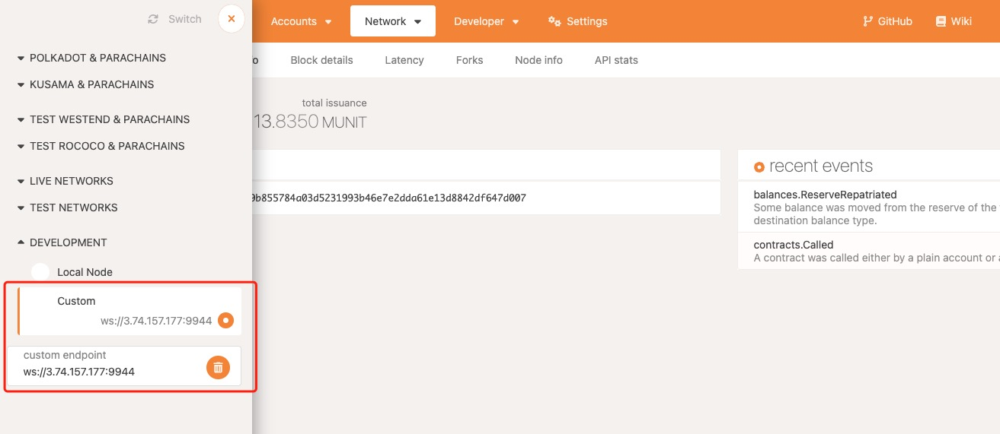
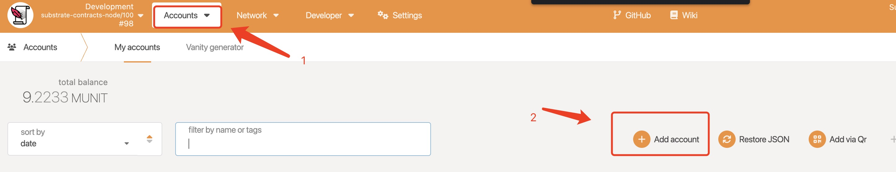
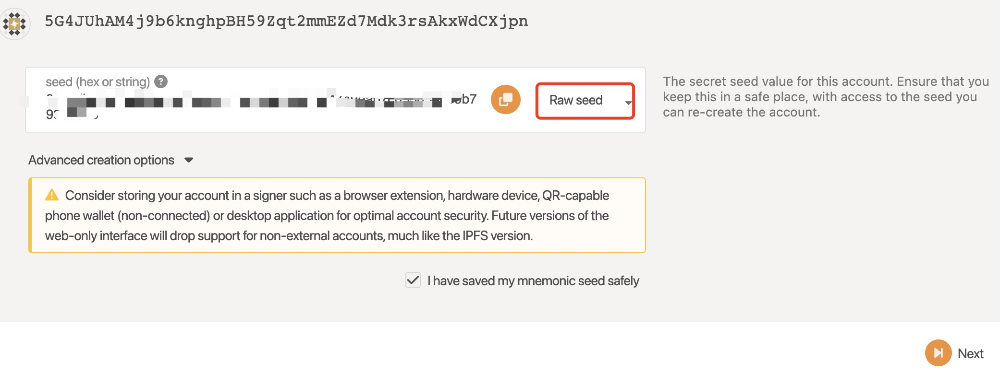
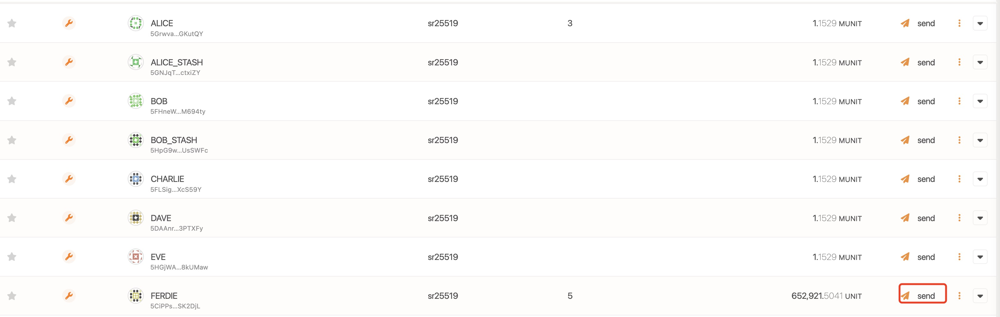
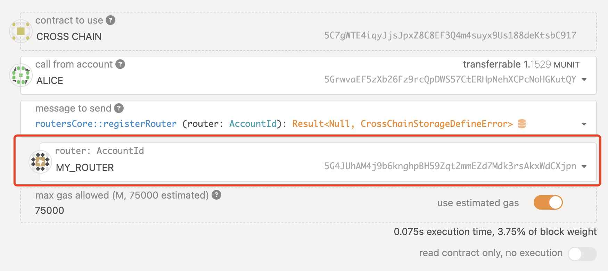
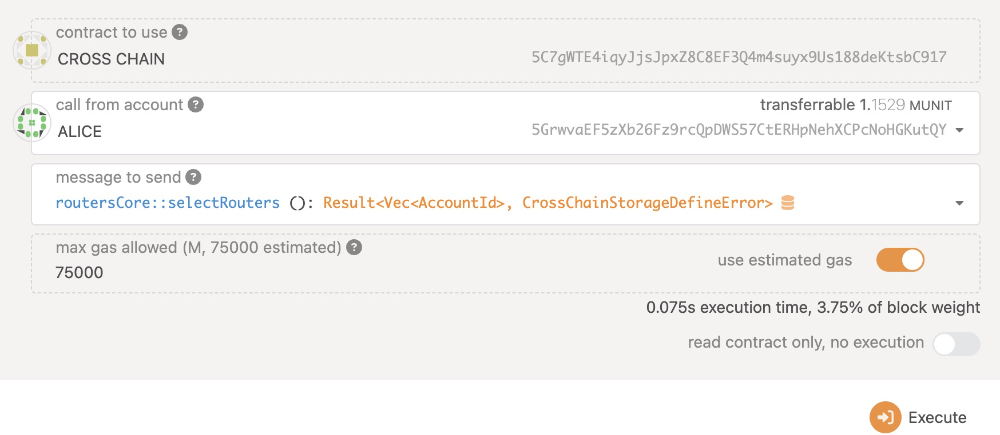
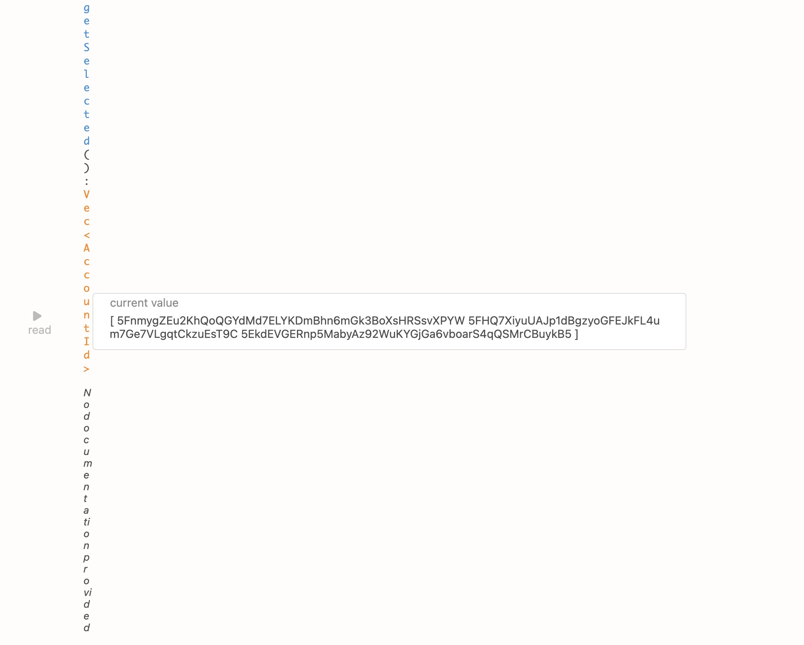
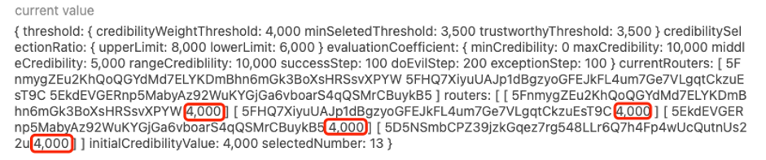

# Test Router

## Clone this repo
```sh
git clone git@github.com:dantenetwork/ink-test-router.git
cd ./ink-test-router
```

## Pull router docker image

```sh
sudo docker pull registry.us-west-1.aliyuncs.com/cherima/dante
```

## Create a router account

Use [polkadot.js](https://polkadot.js.org/apps/#/explorer).

Connect the substrate rpc, mentioned in [Ink! Test Guide](https://github.com/dantenetwork/protocol-stack-for-ink/blob/feature-sqos/test/README.md#test-environment).


<p align="center">Fig 1. create account</p>

Create an account as `Raw seed` and save the seed for configuration.



<p align="center">Fig 2. create account, choose Raw seed</p>

You can use one of those accounts, as shown in Fig.3, to transfer token to you router account.


<p align="center">Fig 3. transfer token</p>


## Configuration

```sh
$ cd config
$ mv .secret.example .secret
```

Modify the contents of `.secret`, as shown following.

```json
{
    "POLKADOTTEST": "YOU RAW SEED"
}
```

For `default.json`, keep `networks.POLKADOTTEST.nodeAddress` and `networks.POLKADOTTEST.crossChainContractAddress` consistent with mentioned in [Ink! Test Guide](https://github.com/dantenetwork/protocol-stack-for-ink/blob/feature-sqos/test/README.md#test-environment).

## Remember to contact us before run the docker as the Testnet is not fully open to the public at this stage  

* discord: `xeeeyu#4107`

## Run docker

```sh
$ sudo docker compose up
## show logs
$ sudo docker logs -f my_router
```

## Register as router

After started the router node, you need to register as a router in the cross chain contract. Enter the account address created in the [Create a router account](./README.md#create-a-router-account).


<p align="center">Fig 5. register</p>

After register, You need to call the `select_routers`, then you will be selected and will start to receive the latest cross-chain messages, as shown in fig 6.


<p align="center">Fig 6. selecte routers</p>

You can view all seleted routers, as shown in fig 7.


<p align="center">Fig 7. show all selected routers</p>

The default initial credibility of the routers at the time of registration is 4000.


<p align="center">Fig. 8 registered routers information</p>